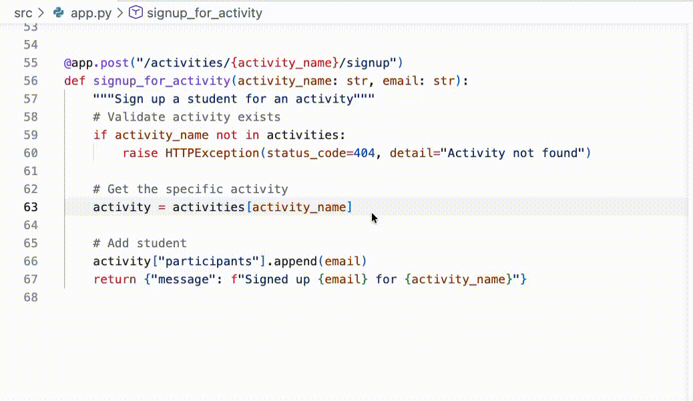

## Passo 2: Trabalhando com o Copilot

No passo anterior, o GitHub Copilot conseguiu nos ajudar a conhecer o projeto. Isso por si só já economiza muito tempo, mas agora vamos colocar a mão na massa!

:bug: **HÁ UM BUG NO SITE** :bug:

Descobriu-se que algo está errado no fluxo de inscrição.
Atualmente, os estudantes conseguem se registrar na mesma atividade **mais de uma vez**! Vamos ver até onde o Copilot pode nos levar para descobrir a causa e criar uma correção adequada.

Antes de mergulharmos, uma breve introdução sobre como o Copilot funciona. 🧑‍🚀

### 📖 Teoria: Como o Copilot funciona

Em resumo, você pode pensar no Copilot como um colega de trabalho muito especializado. Para ser eficaz com ele, você precisa fornecer informações de fundo (contexto) e direcionamento claro (prompts). Além disso, diferentes pessoas são melhores em diferentes coisas por causa de suas experiências únicas (modelos).

- **Como fornecemos contexto?:** No nosso ambiente de codificação, o Copilot considerará automaticamente o código próximo e as abas abertas. Se você estiver usando o chat, também pode se referir explicitamente a arquivos.

- **Qual modelo devemos escolher?:** Para nosso exercício, não deve importar muito. Experimentar diferentes modelos faz parte da diversão! Isso é outra lição! 🤖

- **Como faço prompts?:** Ser explícito e claro ajuda o Copilot a fazer o melhor trabalho. Mas, diferente de alguns sistemas tradicionais, você sempre pode esclarecer sua direção com prompts de acompanhamento.

> [!TIP]
> Existem várias outras formas de complementar o conhecimento e as capacidades do Copilot como [chat participants](https://docs.github.com/en/copilot/using-github-copilot/copilot-chat/github-copilot-chat-cheat-sheet?tool=vscode#chat-participants), [chat variables](https://docs.github.com/en/copilot/using-github-copilot/copilot-chat/github-copilot-chat-cheat-sheet?tool=vscode#chat-variables), [slash commands](https://docs.github.com/en/copilot/using-github-copilot/copilot-chat/github-copilot-chat-cheat-sheet?tool=vscode#slash-commands-1), e [MCP tools](https://code.visualstudio.com/docs/copilot/chat/mcp-servers).

### :keyboard: Atividade: Use o Copilot para corrigir nosso bug de registro :bug:

1. Vamos pedir ao Copilot para sugerir de onde nosso bug pode estar vindo. Abra o painel do **Copilot Chat** no **Ask mode** e pergunte o seguinte.

   > 
   >
   > ```prompt
   > #codebase Estudantes conseguem se registrar duas vezes na mesma atividade.
   > De onde esse bug pode estar vindo?
   > ```

1. Agora que sabemos que o problema está no arquivo `src/app.py` e no método `signup_for_activity`, vamos seguir a recomendação do Copilot e corrigi-lo (semi-manualmente). Começaremos com um comentário e deixaremos o Copilot terminar a correção.

   1. Abra o arquivo `src/app.py`.

      > 💡 **Dica:** Se o Copilot mencionar `src/app.py` no chat, você pode clicar no arquivo diretamente na conversa para abri-lo.

   1. Perto do final do arquivo, encontre a função `signup_for_activity`.

   1. Encontre a linha de comentário que descreve a adição de um estudante. Acima disso é onde parece lógico fazer nossa verificação de registro.

   1. Digite o comentário abaixo e pressione enter para ir para a próxima linha. Após um momento, texto sombreado temporário aparecerá com uma sugestão do Copilot! Legal! :tada:

      Comment:

      ```python
      # Validate student is not already signed up
      ```

      

   1. Pressione `Tab` para aceitar a sugestão do Copilot e converter o texto sombreado em código.

   <details>
   <summary>Exemplo de Resultados</summary><br/>

   O Copilot está evoluindo a cada dia e pode nem sempre produzir os mesmos resultados. Se você não estiver satisfeito com as sugestões, aqui está um exemplo de resultado válido que produzimos durante a criação deste exercício. Você pode usá-lo para continuar.

   ```python
   @app.post("/activities/{activity_name}/signup")
   def signup_for_activity(activity_name: str, email: str):
      """Sign up a student for an activity"""
      # Validate activity exists
      if activity_name not in activities:
         raise HTTPException(status_code=404, detail="Activity not found")

      # Get the activity
      activity = activities[activity_name]

      # Validate student is not already signed up
      if email in activity["participants"]:
        raise HTTPException(status_code=400, detail="Student is already signed up")

      # Add student
      activity["participants"].append(email)
      return {"message": f"Signed up {email} for {activity_name}"}
   ```

   </details>

### :keyboard: Atividade: Deixe o Copilot gerar dados de exemplo 📋

No desenvolvimento de novos projetos, muitas vezes é útil ter alguns dados falsos com aparência realista para testes. O Copilot é excelente nessa tarefa, então vamos adicionar mais algumas atividades de exemplo e apresentar outra forma de interagir com o Copilot usando o **Inline Chat**

O **Inline Chat** e o painel do **Copilot Chat** são similares, mas diferem no escopo: o Copilot Chat lida com questões mais amplas, multi-arquivo ou exploratórias; o Inline Chat é mais rápido quando você quer ajuda direcionada na linha ou bloco exato à sua frente.

1. Perto do topo do arquivo `src/app.py` (por volta da linha 23), encontre a variável `activities`, onde nossas atividades extracurriculares de exemplo estão configuradas.

1. Selecione todo o dicionário `activities` clicando e arrastando do topo até o final. Isso ajuda a fornecer contexto para o Copilot no próximo prompt.

   


1. Abra o Inline Chat do Copilot usando o atalho de teclado `Ctrl + I` (Windows) ou `Cmd + I` (Mac).

   > 💡 **Dica:** Outra forma de abrir o Inline Chat do Copilot é: `clique direito` em qualquer uma das linhas selecionadas -> `Open Inline Chat`.

1. Digite o seguinte prompt e pressione Enter ou o botão **Send** à direita.

   > 
   >
   > ```prompt
   > Adicione mais 2 atividades relacionadas a esportes, mais 2 atividades
   > artísticas e mais 2 atividades intelectuais.
   > ```

1. Após um momento, o Copilot começará a fazer alterações diretamente no código. As mudanças serão estilizadas de forma diferente para facilitar a identificação de adições e remoções. Reserve um momento para inspecionar e verificar as mudanças, e então pressione o botão **Keep**.

   <details>
   <summary>Exemplo de Resultados</summary><br/>

   O Copilot está evoluindo a cada dia e pode nem sempre produzir os mesmos resultados. Se você não estiver satisfeito com as sugestões, aqui está um exemplo de resultado que produzimos durante a criação deste exercício. Você pode usá-lo para continuar, se tiver problemas.

   ```python
   # In-memory activity database
   activities = {
      "Chess Club": {
         "description": "Learn strategies and compete in chess tournaments",
         "schedule": "Fridays, 3:30 PM - 5:00 PM",
         "max_participants": 12,
         "participants": ["michael@mergington.edu", "daniel@mergington.edu"]
      },
      "Programming Class": {
         "description": "Learn programming fundamentals and build software projects",
         "schedule": "Tuesdays and Thursdays, 3:30 PM - 4:30 PM",
         "max_participants": 20,
         "participants": ["emma@mergington.edu", "sophia@mergington.edu"]
      },
      "Gym Class": {
         "description": "Physical education and sports activities",
         "schedule": "Mondays, Wednesdays, Fridays, 2:00 PM - 3:00 PM",
         "max_participants": 30,
         "participants": ["john@mergington.edu", "olivia@mergington.edu"]
      },
      "Basketball Team": {
         "description": "Competitive basketball training and games",
         "schedule": "Tuesdays and Thursdays, 4:00 PM - 6:00 PM",
         "max_participants": 15,
         "participants": []
      },
      "Swimming Club": {
         "description": "Swimming training and water sports",
         "schedule": "Mondays and Wednesdays, 3:30 PM - 5:00 PM",
         "max_participants": 20,
         "participants": []
      },
      "Art Studio": {
         "description": "Express creativity through painting and drawing",
         "schedule": "Wednesdays, 3:30 PM - 5:00 PM",
         "max_participants": 15,
         "participants": []
      },
      "Drama Club": {
         "description": "Theater arts and performance training",
         "schedule": "Tuesdays, 4:00 PM - 6:00 PM",
         "max_participants": 25,
         "participants": []
      },
      "Debate Team": {
         "description": "Learn public speaking and argumentation skills",
         "schedule": "Thursdays, 3:30 PM - 5:00 PM",
         "max_participants": 16,
         "participants": []
      },
      "Science Club": {
         "description": "Hands-on experiments and scientific exploration",
         "schedule": "Fridays, 3:30 PM - 5:00 PM",
         "max_participants": 20,
         "participants": []
      }
   }
   ```

   </details>

1. Agora você pode ir ao seu site e verificar se as novas atividades estão visíveis.

### :keyboard: Atividade: Use o Copilot para descrever nosso trabalho 💬

Ótimo trabalho corrigindo aquele bug e expandindo as atividades de exemplo! Agora vamos fazer o commit e push do nosso trabalho para o GitHub, novamente com a ajuda do Copilot!

1. Na barra lateral esquerda, selecione a aba `Source Control`.

   > 💡 **Dica:** Abrir um arquivo da área de source control mostrará as diferenças em relação ao original, em vez de simplesmente abri-lo.

1. Encontre o arquivo `app.py` e pressione o sinal `+` para coletar suas alterações na área de staging.

   

1. Acima da lista de alterações em staging, encontre a caixa de texto **Message**, mas **não digite nada** por enquanto.

   - Normalmente, você escreveria uma breve descrição das alterações aqui, mas agora temos o Copilot para ajudar!

1. À direita da caixa de texto **Message**, encontre e clique no botão **Generate Commit Message** (ícone de estrelinhas).

1. Pressione o botão **Commit** e o botão **Sync Changes** para enviar suas alterações para o GitHub.

1. Aguarde um momento para a Mona verificar seu trabalho, fornecer feedback e compartilhar a próxima lição.

<details>
<summary>Tendo problemas? 🤷</summary><br/>

Se você não receber feedback, aqui estão algumas coisas para verificar:

- Certifique-se de que enviou as alterações do arquivo `src/app.py` para o branch `accelerate-with-copilot`.

</details>
